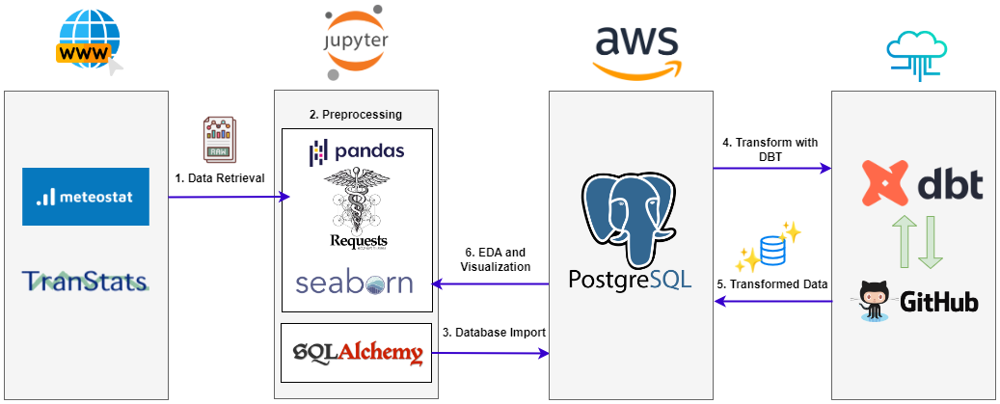

# Snowzilla Project
Analyzing the Impact of the January 2016 Snowstorm on Flight Schedules

## Overview

This project explores the effects of the January 2016 blizzard on flight schedules. Since the majority of the snowstorm occured in three cities, we will be analyzing the air traffic of John F. Kennedy Airport, New York, Dulles International Airport, Washington D.C., and Philadelphia International Airport, Philadelphia. The aim is to understand how severe weather conditions influenced flight operations, particularly focusing on delays and cancellations. 

The project combines a range of data processing and analysis techniques, from SQL queries and API data retrieval to data transformation with dbt and analysis using Python and pandas.

## Project Workflow
### _1. Data Retrieval_
- **Flights**
     - **File**: `get_flights.ipynb`
     - **Description**: Read the flight data for the required time period from the [Bureau of Transportation Statistics website](https://transtats.bts.gov) and perform some basic preprocessing. Then, import into the PostgreSQL database schema provided by Spiced Academy. 
- **Weather**  
     - **File**: `get_weather_data.ipynb`
     - **Description**: Contains the code to get weather data from the [Meteostat API](https://dev.meteostat.net/api/), storing into pandas DataFrames, and then importing as tables to Postgres. 
### _2. Data Transformation_
- Use dbt to transform data into insightful tables and summarize useful statistics.
     - **Folder**: `dbt_weathervsflights`
     - **Description**: Contains the dbt repo and models used for prepping and staging the data. Here we joined the weather and flights data tables so we can see the weather conditions for each scheduled flight.  
### _3. Data Analysis_
- Get the transformed data into pandas DataFrames and perform basic EDA. 
     - **File**: `eda.ipynb`
     - **Description**: Uses SQLAlchemy to retrieve data and gain some initial insights through visualizations. 

## Workflow Summary

 
 ## Tools and Technologies Used
- SQL 
- APIs
- dbt
- Pandas
- SQLAlchemy
- Data Visualization Libraries: matplotlib, seaborn
- Github

## Acknowledgements
This project was completed as part of the coursework at Spiced Academy's Data Analytics program. I would like to thank my instructors and peers at Spiced Academy for their support and guidance throughout the project.
